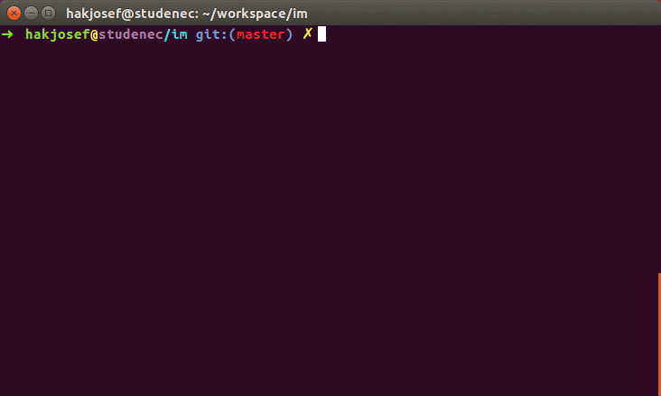

# IM: Simple Command Line Image Manipulation Tool
IM is easy-to-use fast image manipulation command line tool. It enables both single and __batch__ image processing.

* [Install](#install)
* [Usage](#usage)
* [Examples](#examples)
* [Dependencies](#deps)

You can resize, join (stack), rotate, convert and do more with your images without using any GUI.

## Install
Install program as a standard Python package:

~~~bash
pip install .
~~~

## Usage
Application is used using command line with `im` command.

### Help option
Use `--help` option for global help and subcommands:
~~~bash
im --help
im resize --help
~~~

Help:
~~~bash
Usage: im [OPTIONS] COMMAND [ARGS]...

  Image manipulation tool.

Options:
  --help  Show this message and exit.

Commands:
  border     Add border to image.
  convert    Convert image to another format.
  crop       Crop image using [x, y, width, height]...
  ev         Evaluate common code over image.
  exif       Exif manipulation command.
  filter     Filter input images using given criterion.
  find_ext   Find correct image extension.
  find_noim  Find non-image files.
  gauss      Generate image with Gauss noise.
  gray       Convert image to grayscale.
  optimize   Optimize JPG compression.
  rename     Rename image using pattern.
  resize     Resize image to inserted size (higher...
  rotate     Rotate image according to exif orientation...
  show       Show image(s) - terminal view.
  stack      Join inserted images vertically (default) or...
~~~

### Examples
You can get testing `lena.jpg` image [here](https://raw.githubusercontent.com/opencv/opencv/master/samples/data/lena.jpg).

Optimize `.jpg` image file size:
~~~bash
im optimize mountains.jpg
# mountains.jpg --> mountains_optimized.jpg
# 5.4 MB --> 2.2 MB (optimization: 60.2 %)
~~~

Rotate image according exif data:
~~~bash
im rotate egypt.jpg
# egypt.jpg --> egypt_rotated.jpg rotating ...
~~~

Resize image to max. dimension 1000 pixels:
~~~bash
im resize lena.jpg -s 1000
# lena.jpg --> lena_resized.jpg resizing ...
~~~

Join multiple images vertically or horizontally (`-h`):
~~~bash
im stack lena.jpg lena.jpg
# lena.jpg, lena.jpg --> lena.jpg-lena.jpg joining ...
~~~

Show exif data:
~~~bash
im exif mountains.jpg
# Model b'Nokia 6'
# DateTime b'2018:06:01 13:28:20'
# ...
~~~

Remove exif data:
~~~bash
im exif mountains.jpg -r
# mountains.jpg removing exif.
~~~

Convert between image formats:
~~~bash
im convert lena.jpg -e .png
# lena.jpg --> lena.png
~~~

Rename using exif data:
~~~bash
im rename ./egypt.jpg -p '%Y_%m_%d-%H_%M_%S-dovolena.jpg'
# ./egypt.jpg --> ./2018_12_04-10_20_00-dovolena.jpg
~~~

Crop image with specific rectangle:
~~~bash
im crop lena.jpg -x 100 -y 100 -w 200 -h 300
# lena.jpg --> lena_crop.jpg croping ...
~~~

Convert all `.jpg` images in current folder to grayscale:
~~~bash
im gray lena.jpg
# lena.jpg --> lena_gray.jpg graying ...
~~~

### Universal options
- Overwrite original file (be careful), using `-w`.
- Use batch processing, using list of images (or globing), `im gray *.jpg`.

## Dependencies
All dependencies are standard pip installable packages. They are automatically installed with setup script.

* [Pillow](https://python-pillow.org/) - _Image manipulation package._
* [Numpy](http://www.numpy.org/) - _Matrix processing package._
* [Click](http://click.pocoo.org/5/) - _CLI helper package._
* [Piexif](http://piexif.readthedocs.io/en/latest/) - _EXIF data processing package._
